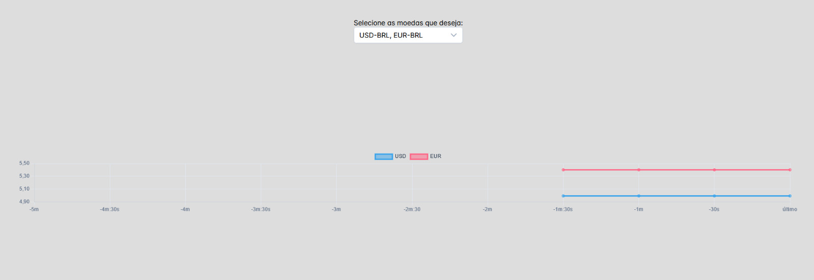

# **Apresentação:**



</br>
</br>

# :book: **Sobre:**

Criei este projeto usando Vue, com a intenção de criar um gráfico que consuma a [API de cotações](https://docs.awesomeapi.com.br/api-de-moedas) a cada 30 segundos, atualizando os valores no gráfico.
O endpoint que está sendo consumido na API é o:

    https://economia.awesomeapi.com.br/json/last/:moedas.

Também é consumido um XML de todos os possíveis valores que a API suporta no endpoint:

    https://economia.awesomeapi.com.br/xml/available

O XML recebido é convertido em JSON e manipulado para exibir as opções no input.

---

# :scroll: Como baixar e utilizar o projeto:

```js

// clonar o repositório

    $ git clone https://github.com/P-L-T-S/quotationChart.git

// instalar as dependencias

    $ npm install

// iniciar o projetos

    $ npm run dev

```

---

## **Conceitos e técnicas abordadas:**

-   Vue, Typescript, SCSS;
-   Requisição à API;
-   Async/Await;
-   Manipulação de XML e JSON;
-   Ref e manipulação de estados;
-   onBeforeMounted, Watch, Ref;
-   Design responsivo;

---

</br>

# :rocket: **Técnologias e libs utilizadas:**

-   **VUE**;
-   **SCSS**;
-   **Typescript**;
-   **PrimeVue Components**;
